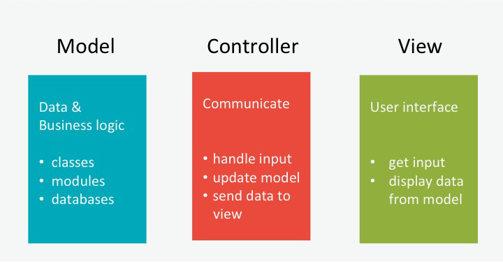

# MVC:  Model-View-Controller

## Introducción

Modelo-vista-controlador es un [patron de diseño](http://en.wikipedia.org/wiki/Software_design_pattern), el cual podemos usar como una guia para solucionar ciertos tipos de problemas. De que tipo de problemas estamos hablando?

- Tengo una aplicación (clases, módulos, data, etc..).
- Tengo que crear una interfaz para usar la aplicación.
- Tengo que coordinar el flujo entre el usuario y la aplicación.

## Dividiendo Responsabilidades

Al aplicar los principios de la programación orientada a objetos, ya empezaste a escribir métodos que se responsabilizan de crear una solo cosa. Usando el patron MVC las responsabilidades van a estar divididas entre:

1. los datos y la lógica del negocio.
2. la interfaz de usuario.
3. coordinar entre los dos.

La siguiente imagen nos muestra esta separación de responsabilidades.

*Figura 1.* Model-View-Controller Overview

### Modelo
El modelo se encarga de manejar los datos y la lógica de nuestra aplicación. Las clases, módulos etc, de ahora en adelante se conocerán como los modelos. Las clases van a estar respaldadas por la base de datos para persistir el estado de la aplicación.

### Vista
La vista se encarga de todas las responsabilidades relacionadas con la interfaz de usuario. Si el usuario necesita enviar algún tipo de input, la vista se lo pide. Si hay que mostrarle información al usuario la vista se la muestra. En una aplicación de terminal la vista es la que se encarga de hacer los `gets` y `puts`.

### Controlador
El controlador se para entre el modelo y la vista. La vista provee la interfaz para que el usuario pueda enviarnos comandos, los cuales son transferidos al controlador. Luego el controlador interpreta el request del usuario y determina que toca hacer. Generalmente va a tener que hablar con el Modelo. Por ejemplo es posible que el controlador necesite algunos datos, de modo que se los va a preguntar al Modelo, y luego se los va a pasar de devuelta a la vista. La cual se va a encargar de mostrarlos al usuario.

## Flujo de trabajo de una aplicación:

*Figura 2.* Flujo de trabajo: Model-View-Controller

La figura 2 muestra como funciona el flujo de trabajo desde el input del usuario hasta el output en el patron MVC. Este empieza con el usuario dándonos un poco de input a travez de la interfaz que la vista provee. La vista le pasas el este input al controlador, el cual lo interpreta. En este ejemplo el controlador determinada que necesita un poco de datos, por lo cual le pregunta al modelo para que se los de. El modelo luego se encarga de recolectar todos los datos que necesite para devolvérselos al controlador. El controlador luego le pasa los datos a la vista. La vista le muestra estos datos al usuario, y el ciclo esta listo para repetirse de nuevo.
